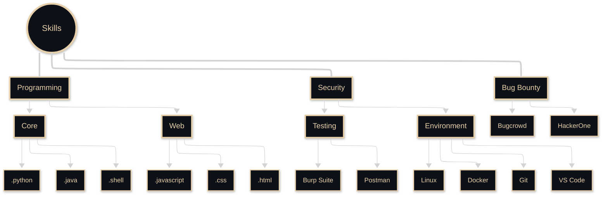

<!-- <body style="background-color: #000; color:rgb(0, 0, 0);"> -->

<p align="right">
    
</p>

<div style="border:2px solid #E7CFAA; border-radius: 10px; padding: 20px; margin-bottom: 20px;">

<!-- name banner -->
<p align="center">
    <a href="https://github.com/mahaveer-choudhary">
        
    </a>
</p>

<!-- follow buttons  -->
<p align="center">
    <a href=""></a>
    <a href="https://github.com/mahaveer-choudhary"></a>
    <a href="https://twitter.com/mahaveer6886"></a>
</p>
</div>

<div style="border: 2px solid #E7CFAA; border-radius: 10px; padding: 20px; margin-bottom: 20px;">

<!-- who am i  -->
<h2 align="center">
    
</h2>

<!-- typing svg  -->
<p align="center">
    <a href="https://github.com/mahaveer-choudhary">
        
    </a>
</p>


```python
#!/usr/bin/python
#_*_ coding: utf-8 _*_

class SecurityResearcher:
    def __init__(self):
    def.name = "Mahaveer"
    self.role = "Bug Hunter, Security Researcher"
    self.language_spoken = ["hindi, English"]
    self.portfolio = ""

    def say_hi(self):
        print("Thanks for coming!")
        print(f"Check out my portfolio at: {self.portfolio}")

me = SecurityResearcher()
me.say_hi()
```

<br> <br>

<!-- quote  -->
<div align="right">
    <a href="https://x.com/mahaveer6886">
        
    </a>
    <a href="https://github.com/mahaveer-choudhary">
        
    </a>
</div>

</div>

<br> <br> <br>

<!-- knowledge & skills  -->
<p align="left" style="display: flex; align-items: center;">
    <a href="https://x.com/mahaveer6886">
        
    </a>
    
</p>

<br>

<!-- Skills -->



<br> <br> <br>

<!-- Projects -->
<div align="right" style="border: 2px solid #E7CFAA; border-radius: 10px; padding: 20px; margin-bottom: 20px;">

  <p align="right" style="display: flex; align-items: center;">
    <a href="https://x.com/mahaveer6886">
        
    </a>
    
  </p>

  <div style="display: flex; flex-wrap: wrap; justify-content: center; gap: 40px;">
    <a href="https://github.com/mahaveer-choudhary/DorkXplorer">
      
    </a>
    <a href="https://github.com/mahaveer-choudhary/xss-scanner">
      
    </a>
    <a href="https://github.com/mahaveer-choudhary/ReconX">
      
    </a>
    <a href="https://github.com/mahaveer-choudhary/mylfi">
      
    </a>
    <a href="https://github.com/mahaveer-choudhary/my403">
      
    </a>
    <a href="https://github.com/mahaveer-choudhary/blind_sqli">
      
    </a>
    <a href="https://github.com/mahaveer-choudhary/keylogger-detector">
      
    </a>
  </div>
</div>

<br> <br> <br>


<div style="border: 2px solid #E7CFAA; border-radius: 10px; padding: 20px; margin-bottom: 20px;">
<!-- GitHub Status -->

<div style="border: 2px solid #E7CFAA; border-radius: 10px; padding: 20px; margin-bottom: 20px;">

<h2 align="center">
  
</h2>


<div align="center" style="display: flex; flex-direction: column; justify-content: center; align-items: center; background-color: #0D1117; padding: 20px; border-radius: 10px; box-shadow: 0 4px 6px rgba(0, 0, 0, 0.1);">
  <div style="display: flex; justify-content: center; align-items: center; margin-bottom: 20px;">
    
    
  </div>
  
  
</div>
</div>

<!-- <div style="border: 2px solid #E7CFAA; border-radius: 10px; padding: 20px; margin-bottom: 20px;"> -->
<!-- Blog Posts -->
<!-- BLOG-POST-LIST:START -->
<!-- BLOG-POST-LIST:END -->
<!-- </div> -->

<!-- Current Focus
<h2 align="center">
  
</h2> -->

<div style="border: 2px solid #E7CFAA; border-radius: 10px; padding: 20px; margin-bottom: 20px;">

<!-- Connect Section -->
<h2 align="center">
  
</h2>

<p align="center">
  <a href="https://x.com/mahaveer-choudhary"></a>
  <a href="https://www.instagram.com/mahaveer_.6886" target="_blank"></a>
  <a href="https://www.linkedin.com/in/mahaveer-choudhary-60559527b"></a>
  <a href="https://t.me/@mahi957111"></a>
</p>

<br>
<br>
<!-- Footer -->
<p align="center">
  
</p>
